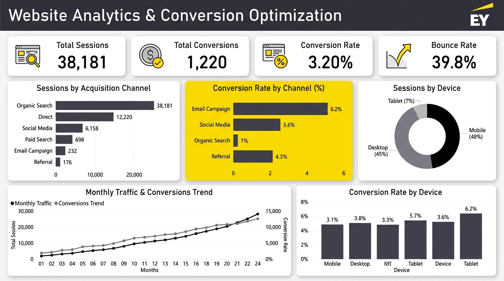

# Website Analytics & Conversion Optimization
### Python | SQL | Pandas | Power BI | Excel

**Author:** Arya Vilas Kadam  
**Target Role:** EY Consulting – Technology Analyst Portfolio  
**Domain:** Data Analytics & Performance Reporting  

```
Business Problem  ➔  Basic SQL Analysis  ➔  Python/Pandas  ➔  Power BI Dashboard  ➔  Business Recommendations
```

---

## Overview

This project demonstrates an end-to-end consulting analytics workflow for an online wellness clinic case study, analyzing patient acquisition channels, user engagement, and appointment booking conversions across a 24-month period (**38,181 sessions**).

By connecting **basic SQL queries**, an automated **Python/Pandas data pipeline**, and a single-page **Power BI executive dashboard**, raw session logs are transformed into clear, actionable business recommendations for leadership.

---

## Business Problem

The clinic's management lacked visibility into their digital patient acquisition funnel:
1. **Traffic Channel Efficacy**: Which marketing channels drove traffic, and which actually produced paying appointment bookings?
2. **User Drop-Off**: Why were visitors leaving the website without completing bookings?
3. **Device Behavioral Differences**: How did user engagement differ between mobile and desktop visitors?
4. **Growth Trajectory**: How were session volumes and appointment bookings evolving over time?

---

## Business Questions

This project answers five fundamental consulting questions:
- **Which acquisition channels generate the most traffic?**
- **Which channels have the highest conversion rates?**
- **Which device type performs better?**
- **Where are the main conversion bottlenecks?**
- **What actions could improve website conversion?**

---

## Dataset

- **Source:** Synthetic Google Analytics web session logs modeled on wellness clinic traffic patterns.
- **Volume:** **38,181 session records** spanning June 2022 to May 2024 (24 months).
- **Key Attributes:**
  - `session_id`: Unique identifier for each visit
  - `date`, `year_month`: Timestamp attributes
  - `traffic_source`: Acquisition channel (`Organic Search`, `Direct`, `Social Media`, `Paid Search`, `Email Campaign`, `Referral`)
  - `device`: Hardware platform (`Mobile`, `Desktop`, `Tablet`)
  - `pages_viewed`: Number of pages visited in the session
  - `session_duration_s`: Engagement time in seconds
  - `bounced`: Boolean flag (`True` if user exited after viewing only 1 page)
  - `converted`: Boolean flag (`True` if session completed an appointment booking)

---

## Tools & Technologies

| Tool / Technology | Purpose in This Project |
|---|---|
| **Python (Pandas, NumPy)** | Automated data ingestion, data quality validation, and KPI calculations |
| **SQL** | Core business queries, multi-dimensional aggregations, and rate metrics |
| **Microsoft Power BI** | Single-page executive dashboard, KPI cards, and trend visualization |
| **Excel / CSV** | Structured intermediate storage and tabular validation |

---

## Methodology

This project follows a 5-stage technology consulting methodology:

1. **Raw Data Ingestion & Quality Check**: Validated 38,181 records in Python; confirmed 0 missing values and 0 duplicate sessions.
2. **Basic SQL Exploratory Analysis**: Authored modular SQL queries (`sql/`) answering business questions using `SELECT`, `GROUP BY`, `ORDER BY`, `COUNT`, `SUM`, `AVG`, and `CASE WHEN`.
3. **Python/Pandas Automation**: Built a lightweight script (`python/generate_and_analyse.py`) executing 4 core aggregations and exporting CSV summaries in under **0.1 seconds**.
4. **Power BI Executive Dashboard**: Visualized KPIs, channel rankings, device shares, and 24-month trends on a single executive page.
5. **Insights & Recommendations**: Formulated structured business recommendations directly supported by empirical data.

---

## Key KPIs

| KPI | Metric Value | Business Meaning |
|---|---|---|
| **Total Sessions** | **38,181** | Total website visits over the 24-month period |
| **Total Conversions** | **1,220** | Confirmed online appointment bookings |
| **Conversion Rate** | **3.20%** | Percentage of visits that completed a booking |
| **Bounce Rate** | **39.8%** | Percentage of single-page visits without interaction |
| **Avg Session Duration** | **2.9 mins** | Average visitor time on site |

---

## Dashboard

Single-page Power BI executive dashboard built to present high-level metrics to stakeholders:



### Dashboard Visuals:
- **Top KPI Cards**: Total Sessions (38,181), Total Conversions (1,220), Conversion Rate (3.20%), Bounce Rate (39.8%).
- **Sessions by Channel**: Horizontal bar chart identifying Organic Search (14.4k) and Direct (8.6k) as volume leaders.
- **Conversion Rate by Channel**: Highlighting Email Campaign as top converter at **6.2%**.
- **Sessions by Device**: Donut chart showing Mobile (48%), Desktop (45%), and Tablet (7%).
- **Conversion Rate by Device**: Bar chart comparing Mobile (3.0%), Desktop (3.4%), and Tablet (3.5%).
- **Monthly Traffic & Conversions Trend**: Line chart tracking 24-month steady growth from ~1,200 to 2,054 sessions/month.

---

## Executive Insights

Every insight pairs an empirical finding with its business implication:

- **Insight 1: Organic Search is the Primary Volume Driver**  
  - *Finding:* Organic Search generated **38% of total traffic** (14,402 sessions) with a steady **3.3% conversion rate** (475 bookings).  
  - *Implication:* Search visibility represents the clinic's largest patient acquisition channel, requiring sustained SEO investment.

- **Insight 2: Email Campaigns Deliver the Highest Conversion Intent**  
  - *Finding:* Email Campaigns achieved the highest conversion rate across all sources at **6.2%**, despite accounting for only **6% of total sessions** (2,270 visits).  
  - *Implication:* Email reaches high-intent prospects and represents the most cost-effective channel for expanding booking volume.

- **Insight 3: Social Media Suffers from High Drop-Off and Low Conversion**  
  - *Finding:* Social Media drove 6,748 sessions (18% of traffic) but converted at only **1.1%**, while suffering the highest bounce rate across all channels at **53%**.  
  - *Implication:* Broad social media marketing attracts casual browsers rather than qualified healthcare leads; current ad spend on social may be underperforming.

- **Insight 4: Mobile Traffic Lags in Conversion Efficiency**  
  - *Finding:* Mobile accounts for **48% of total visits** (18,453 sessions) but converts at **3.0%**, trailing Desktop at **3.4%**.  
  - *Implication:* Because nearly half of all visitors arrive on smartphones, even minor friction in the mobile booking form directly impacts appointment numbers.

- **Insight 5: Consistent Long-Term Growth Trajectory**  
  - *Finding:* Monthly sessions climbed steadily from ~1,200/month in June 2022 to **2,054/month** in May 2024 (~3% compounding monthly growth).  
  - *Implication:* Clinic brand awareness is consistently expanding, providing a solid baseline for conversion optimization.

---

## Business Recommendations

Based on empirical data findings, four practical recommendations are proposed:

1. **Increase Focus on High-Converting Acquisition Channels**:  
   Scale email marketing frequency and introduce personalized appointment reminders to capitalize on the channel's **6.2% conversion rate**.
2. **Investigate and Streamline Mobile User Experience**:  
   Audit the mobile booking flow to reduce form friction and close the 0.4% conversion gap between mobile and desktop visitors.
3. **Review Underperforming Traffic Sources**:  
   Refine social media campaign targeting toward intent-driven healthcare demographics rather than broad awareness to decrease the 53% bounce rate.
4. **Prioritize Channel Optimization Over Raw Volume**:  
   The analysis identifies concrete opportunities to improve conversion through channel optimization and user-experience improvements rather than solely increasing top-of-funnel marketing spend.

---

## Project Structure

```
website-analytics-report/
│
├── data/
│   ├── website_sessions.csv            # Raw session logs (38,181 records)
│   ├── traffic_source_analysis.csv     # Channel performance summary
│   ├── device_breakdown.csv            # Device share & conversion summary
│   └── monthly_performance.csv         # 24-month trend aggregation
│
├── sql/
│   ├── 01_overall_kpis.sql             # SQL: High-level KPI calculation
│   ├── 02_channel_performance.sql      # SQL: Traffic sources breakdown
│   ├── 03_device_analysis.sql          # SQL: Device volume and conversion share
│   └── 04_monthly_trends.sql           # SQL: Month-over-month performance trends
│
├── python/
│   └── generate_and_analyse.py         # Automated data validation & analysis pipeline
│
├── dashboard/
│   ├── dashboard_screenshot.png        # Power BI executive dashboard visual
│   └── README.md                       # Power BI visual layout & DAX measures guide
│
├── README.md                           # Main consulting documentation
└── .gitignore                          # Excludes Python bytecode and OS files
```

---

## How to Run

### 1. Python Analytics Pipeline
Requires Python 3.8+ and Pandas:
```bash
# Install dependency
pip install pandas

# Run the automated pipeline from the repository root
python3 python/generate_and_analyse.py
```
*Validates data quality, prints all 4 analyses in under 0.1s, and exports summary CSVs to `data/`.*

### 2. SQL Analysis
The SQL scripts in `sql/` can be executed against any standard SQL database (PostgreSQL, MySQL, SQLite, Snowflake, BigQuery) containing the `website_sessions` table:
- Run `sql/01_overall_kpis.sql` for overall totals.
- Run `sql/02_channel_performance.sql` for acquisition channel metrics.
- Run `sql/03_device_analysis.sql` for device performance.
- Run `sql/04_monthly_trends.sql` for month-over-month trends.

---

## Future Improvements

- **Automated Ingestion Pipeline**: Connect the Python script directly to Google Analytics 4 (GA4) API to automate daily data extraction.
- **A/B Testing Framework**: Conduct statistical hypothesis testing on mobile checkout redesign variants.
- **Automated BI Refresh**: Publish the dashboard to Power BI Service with scheduled automated data refreshes via On-Premises Data Gateway.
